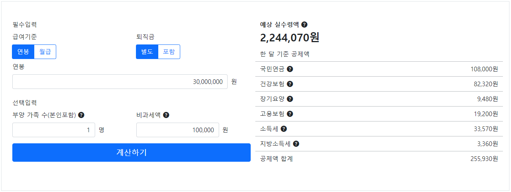

# Sal Saver

Github Pages를 이용해 배포한 [vue-todolist 보러가기](https://hye0ngyun.github.io/sal-saver/)

## Project Goal

- bootstrap, jquery 라이브러리 학습
- 연봉계산기 기능, 레이아웃 클론([사람인 연봉계산기](https://www.saramin.co.kr/zf_user/tools/salary-calculator?))
- 연봉계산기 기능중 공제금 구현을 python으로 구현
- pyscript 라이브러리의 등장으로 client-side에서 python 코드 실행 가능으로 공제금 구하는 python 코드 적용
- 추후 python matplotlib, seaborn과같은 시각화 라이브러리를 활용해 연봉 관리와 그에 따른 시각화를 제공할 예정

## Table of Contents

- [Sal Saver](#sal-saver)
  - [Project Goal](#project-goal)
  - [Table of Contents](#table-of-contents)
  - [Using Skills & Stacks](#using-skills--stacks)
  - [Project Description](#project-description)
    - [실 수령 연봉(월급)계산 기능](#실-수령-연봉월급계산-기능)

## Using Skills & Stacks

- language: html, css, js, python
- framwork: None
- library: bootstrap3, jquery, pyscript, pandas, re

## Project Description

프로젝트 기능 소개

### 실 수령 연봉(월급)계산 기능

세전 연봉(월급)과 각종 옵션을 입력받으면 정보에 따라 각 항목별 공제액을 계산해 월 예상 실수령액을 보여줍니다.

